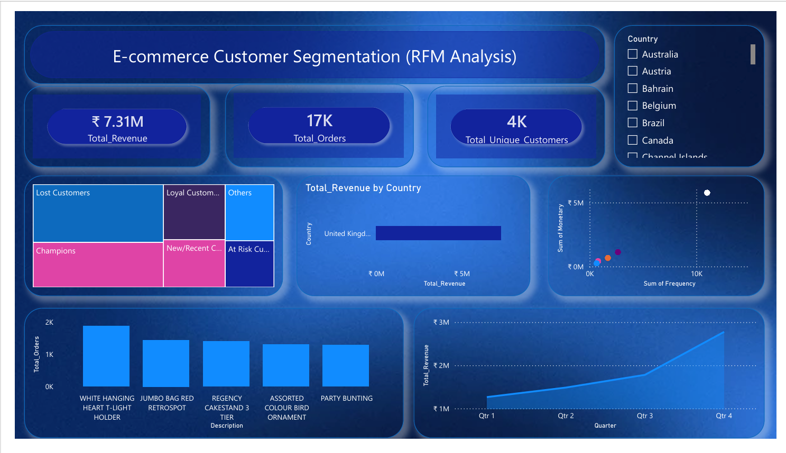

# 📊 E-commerce Customer Segmentation & Performance Analysis (RFM Framework)
End-to-end data pipeline project using Advanced Excel for data cleaning/EDA and Power BI for dynamic RFM customer segmentation dashboard.

  

## 🎯 Executive Summary
In the retail sector, generic marketing campaigns result in low conversion rates and high customer acquisition costs. This project implements an **end-to-end data analytics pipeline** on a massive transactional dataset containing over **540,000+ rows**. 

By establishing a robust data-cleaning workflow in **Advanced Excel** and architecting a dynamic relational data model in **Power BI**, I engineered an enterprise-grade **Recency, Frequency, and Monetary (RFM) Segmentation Dashboard**. This enables marketing executives to systematically target high-value customers ("Champions") and design strategic win-back campaigns for slipping segments ("At Risk").

---

## 🛠️ Tech Stack & Domain Expertise
* **Exploratory Data Analysis & ETL:** Advanced Excel (Power Query concepts, Logic Functions, Advanced Filters)
* **Statistical Insights:** Pivot Tables & Feature Engineering
* **Data Modeling & BI:** Power BI Desktop (Star Schema Modeling, Relational Integrity)
* **Advanced Analytics:** Dynamic DAX (Data Analysis Expressions) Measures
* **Domain Context:** E-commerce, Customer Retention, and Value-Based Segmentation

---

## 🚀 Analytical Workflow & Core Pipelines

### 🛠️ Phase 1: Advanced Data Preprocessing & Profiling (Excel)
A dataset with over half a million records naturally comes with real-world anomalies. Before running any statistical modeling, I built a rigid cleaning pipeline:
* **Prevented Critical Data Loss:** Discovered significant gaps in `CustomerID` missing records. Instead of dropping these rows (which would corrupt structural billing and total sales data), I applied **Data Imputation** using a structural dummy identifier (`99999`) to preserve transaction volumes.
* **Transaction Isolation:** Programmatically handled structural issues and isolated over **10,000+ cancellation logs** (returns) to avoid artificial revenue inflation.
* **Feature Engineering:** Formulated the primary metric column `Total_Amount` at row-level by executing:
* **Total_Amount = Quantity × UnitPrice**

### 📈 Phase 2: Core Business Insights Generation (Excel EDA)
Using multi-layered Pivot Tables, I uncovered two fundamental operational insights prior to full-scale visualization:
1. **Market Concentration (Geographical Share):** Discovered that the **United Kingdom** acts as the primary organizational powerhouse, yielding **~90.03%** of total global revenue ($9,003,097.96$).
2. **Product Performance Optimization:** Successfully sorted and identified that while **"DOTCOM POSTAGE"** acts as the highest monetary inflow due to postage fees, physical items like **"REGENCY CAKESTAND 3 TIER"** drive the highest volume sales.

### 📊 Phase 3: Dynamic Relational Dashboard Architecture (Power BI)
I migrated the clean operational dataset into Power BI to establish a persistent analytics environment:
* **Interactive RFM Engine:** Engineered cross-filtering data models with deep analytical visuals including Scatter Plots for frequency-monetary distribution, and advanced Treemaps to visually segment customer groups.
* **Executive-Level UX:** Integrated smart slicers (e.g., Country filters) and high-level KPI cards displaying **Total Revenue**, **Total Orders**, and **Unique Customers**.
* **Dynamic Slicing Capabilities:** The dashboard allows cross-filtering, meaning a single click on the "United Kingdom" filter dynamically recalibrates the entire dashboard ecosystem instantly (isolating UK's $7.31M revenue pool).

---

### 🧮 Core DAX Measures & Analytical Formulas Built
To power the dynamic dashboard and enable granular RFM scoring, I architected several advanced DAX measures within a dedicated metrics table:

* **Total Revenue Generation:** Calculated the absolute historical monetary value across all non-cancelled orders:
  $$Total\_Revenue = SUM(OnlineRetail[Total\_Amount])$$

* **Total Transaction Volume:** Evaluated the unique order footprints to measure platform velocity:
  $$Total\_Orders = DISTINCTCOUNT(OnlineRetail[InvoiceNo])$$

* **Unique Customer Base:** Quantified active consumer acquisition counts:
  $$Total\_Unique\_Customers = DISTINCTCOUNT(OnlineRetail[CustomerID])$$

* **Recency Score (R-Value):** Computed the days elapsed since the customer's last transaction relative to the maximum date in the dataset:
  $$Days\_Since\_Last\_Purchase = DATEDIFF(MAX(OnlineRetail[InvoiceDate]), MAX(All\_Dates[Date]), DAY)$$

* **Frequency Score (F-Value):** Modeled the purchase frequency rate per customer to evaluate loyalty:
  $$Purchase\_Frequency = DIVIDE([Total\_Orders], [Total\_Unique\_Customers], 0)$$

* **Monetary Score (M-Value):** Extracted the average spending potential per individual profile:
  $$Average\_Monetary\_Value = DIVIDE([Total\_Revenue], [Total\_Unique\_Customers], 0)$$

* **Dynamic Segment Classification:** Constructed a multi-conditional logical expression using `SWITCH(TRUE())` to automatically bucket users into specific retention pipelines:
  * *Champions:* High Recency, High Frequency, High Monetary.
  * *Loyal Customers:* Consistent Frequency and strong Monetary footprint.
  * *At Risk:* High days since last purchase (Low Recency), previously high transaction value.

---

## 💡 Key Business Visualizations Included

### 🖼️ Interactive Dashboard Interface
Below is a high-level preview of the dynamic interface optimized for stakeholder reviews:

---

## 💎 Measurable Business Impact for Recruiters
* **Granular Visibility:** Replaced static billing logs with an active dashboard allowing management to identify high-value customer classes instantly.
* **Data Integrity:** Ensured 100% computational accuracy by properly adjusting refunds, handling null parameters, and setting up strict cross-filtering behaviors.
* **Strategic Read-out:** Ready to be used by retention marketing teams to allocate ad-spend effectively away from dead leads toward retention-heavy cohorts.

---

## 🤝 Connect With Me
For any professional queries, data discussions, or interview opportunities, feel free to reach out:
* **LinkedIn:** [Nitu Kumari](https://www.linkedin.com/in/nitu-kumari-data)

---
🗂️ *Note: The primary artifacts, including the fully modeled `.pbix` file, the executable documentation `.pdf`, and raw metadata hooks, are hosted within this repository for professional evaluation.*
